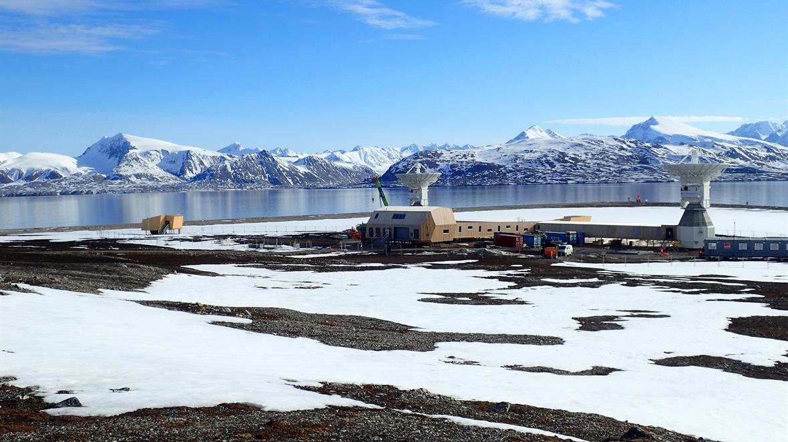

# A short history

The **Where** project was started in the fall of 2015 with the goal of building
software that can analyse and combine data for _VLBI_, _SLR_, _GNSS_ and _DORIS_.

+ **Where** builds on ideas and experiences from the _Geosat_ software

+ The **Where-team** consists of five researchers at the Norwegian Mapping
  Authority (NMA):

    + Michael Dähnn (GPS)
    + Ingrid Fausk (SLR)
    + Geir Arne Hjelle (VLBI, GPS)
    + Ann-Silje Kirkvik (VLBI)
    + Eirik Mysen (VLBI)

+ NMA is currently building / expanding the observatory at Ny-Ålesund

# The new Ny-Ålesund observatory

# Current status

+ All models from the _IERS Conventions_ are implemented for _VLBI_ and _SLR_

    + Many of the models can be reused for the other techniques

    + We participated in a _VLBI Analysis Software Comparison Campaign_
      organized by Onsala with _Geosat_, and are currently testing **Where**
      against these results

    + We are almost done with an orbit integrator for _SLR_ satellites

+ We are currently working on Precise Point Positioning (PPP) for _GPS_

+ We have only done very simple tests for _DORIS_ data so far

# Technology

The **Where** software is mainly being written in _Python_

+ Solid, flexible and fast libraries like `numpy`, `astropy`, `matplotlib` and
  `scipy` are available

+ We use a **HDF5**-based format for storing data while the program is running

+ _Python_ has effective interfaces to _C_ and _Fortran_ code, and we can use
  the **Sofa** and **IERS** software libraries directly

# Technology -- plans

# Technology -- current

# Future plans

At the moment, the highest priorities for **Where** are

+ finishing the _VLBI_ analysis

    + The filter / estimation module

    + Proper output and reporting

+ finishing the _SLR_ analysis

    + The orbit integrator needs some more work

+ finishing PPP for _GPS_ and starting to look at _Galileo_ and possibly
  _Glonass_

    + Orbit integration for GNSS-satellites

# Where is _DORIS_?

Unfortunately _DORIS_ has been put somewhat on hold due to lack of resources.
However,

+ we implemented a _DORIS_-Rinex 3-parser in an early prototype of the software

+ we did some experimental analysis in the old _Geosat_ software

+ we hope to do some simple tests quite soon

    + use Rinex 3-data and given orbits

+ the proper implementation of _DORIS_ will be after _VLBI_ is finished

    + many models can be reused from the other techniques
